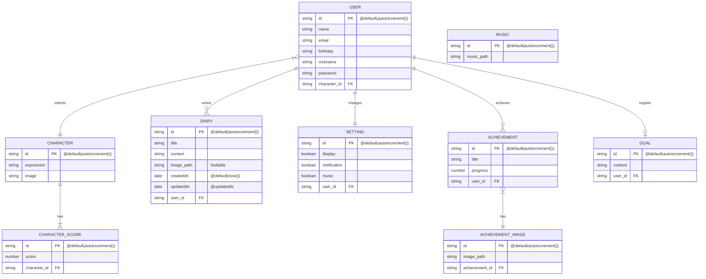

```mermaid
erDiagram
    USER {
        string id PK "@default(autoincrement())"
        string name
        string email
        string birthday
        string nickname
        string password
        string character_id FK
    }

    CHARACTER {
        string id PK "@default(autoincrement())"
        string expression
        string image
    }

    CHARACTER_SCORE {
		    string id PK "@default(autoincrement())"
		    number score
		    string character_id FK

    }

    DIARY {
		    string id PK "@default(autoincrement())"
		    string title
		    string content
		    string image_path "Nullable"
		    date createdAt "@default(now())"
		    date updatedAt "@updatedAt"
		    string user_id FK
    }

    SETTING {
		    string id PK "@default(autoincrement())"
		    boolean display
		    boolean notification
		    boolean music
		    string user_id FK
    }

    ACHIEVEMENT {
		    string id PK "@default(autoincrement())"
		    string title
			  number progress
		    string user_id FK
    }

    ACHIEVEMENT_IMAGE {
		    string id PK "@default(autoincrement())"
		    string image_path
		    string achievement_id FK
    }

    GOAL {
        string id PK "@default(autoincrement())"
        string content
        string user_id FK
    }

    MUSIC {
		    string id PK "@default(autoincrement())"
		    string music_path
    }

    USER }|--|| CHARACTER : selects
    USER ||--o{ DIARY : writes
    USER ||--|| SETTING : changes
    USER ||--o{ ACHIEVEMENT : achieves
    CHARACTER ||--|{ CHARACTER_SCORE : has
    ACHIEVEMENT }|--|| ACHIEVEMENT_IMAGE : has
    USER ||--o| GOAL : register
```
